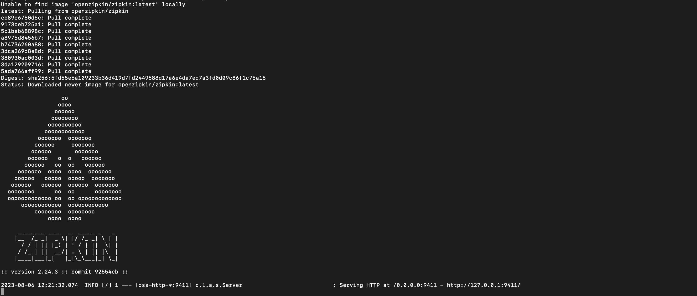
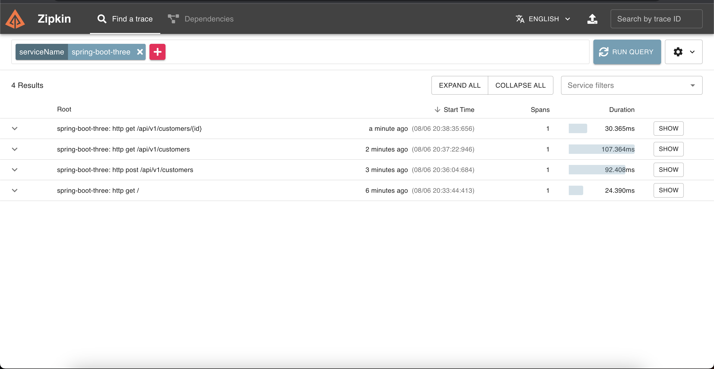
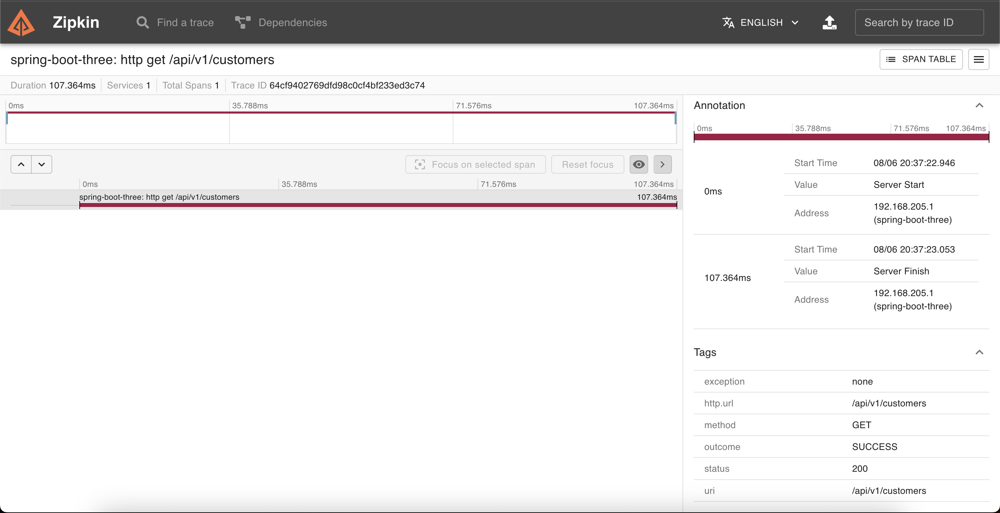

# Spring Boot v3 Application

## Introduction
Spring Boot v3 comes with several exciting new features that enhance the development experience and performance of applications. Some of the key highlights include:

1. Upgraded Dependencies: The v3 release includes updated dependencies, which contribute to better performance, security, and stability of your applications.
2. Java 17 Support: With Spring Boot v3, you can take advantage of the latest features and enhancements in Java 17, ensuring your application stays up-to-date with the latest language improvements.
3. Improved Auto-Configuration: Auto-configuration has been fine-tuned in v3 to provide more intelligent defaults, reducing the need for explicit configuration and simplifying the development process.
4. Enhanced Reactive Support: Spring Boot v3 further improves its support for reactive programming, making it easier to build responsive and scalable applications.

## Micrometer Tracing with Zipkin

In this Spring Boot v3 application, we have integrated Micrometer with Zipkin for advanced tracing capabilities. Micrometer is a powerful metrics instrumentation library that allows us to collect application performance metrics, and Zipkin is a distributed tracing system used to monitor and troubleshoot microservices-based architectures.

### Running Zipkin with Docker

To utilize the tracing functionality with Zipkin, ensure that Docker is installed on your computer. If Docker is not installed, please follow the official Docker installation guide for your operating system.

Once Docker is set up, execute the following command in your terminal to run the latest version of Zipkin:
```
docker run -p 9411:9411 openzipkin/zipkin:latest
```



This command pulls the latest Zipkin Docker image from the Docker Hub and starts the Zipkin container, exposing the Zipkin UI on port 9411 of your localhost. You can then access the Zipkin UI by navigating to http://127.0.0.1:9411 in your web browser.

With Zipkin up and running, the Spring Boot v3 application will automatically send trace data to Zipkin through Micrometer, allowing you to analyze and visualize the request paths across your microservices.




